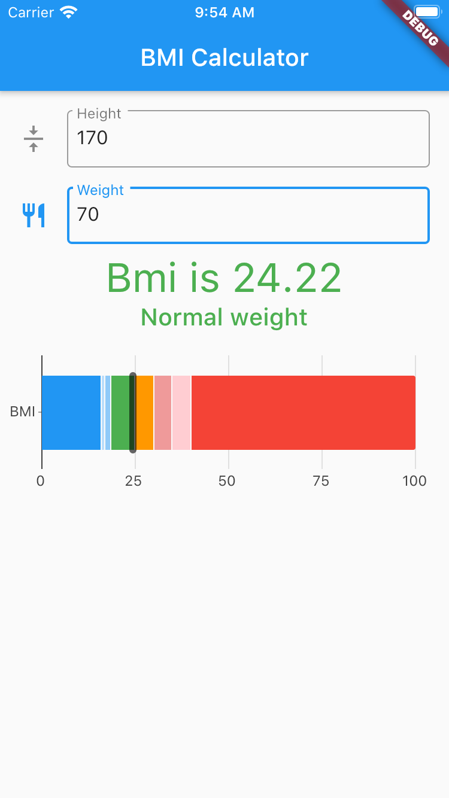
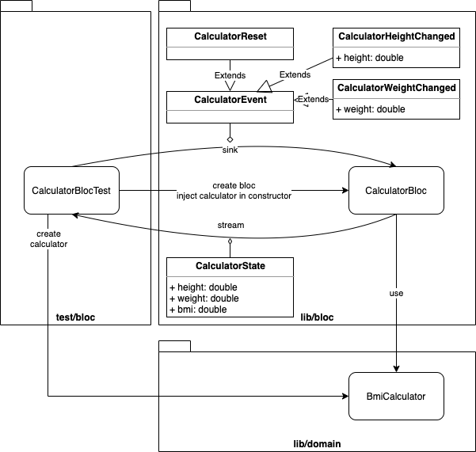
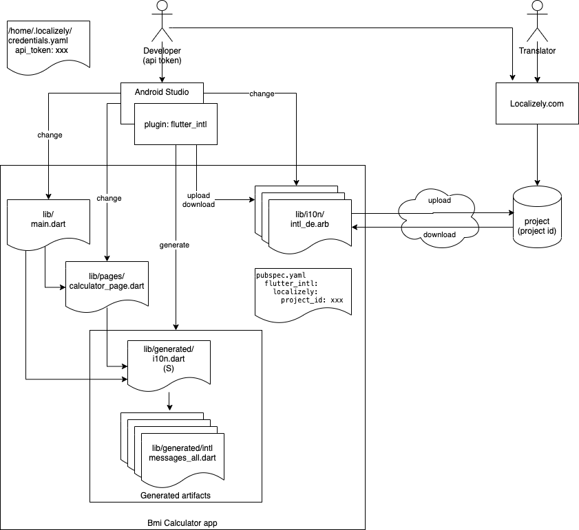
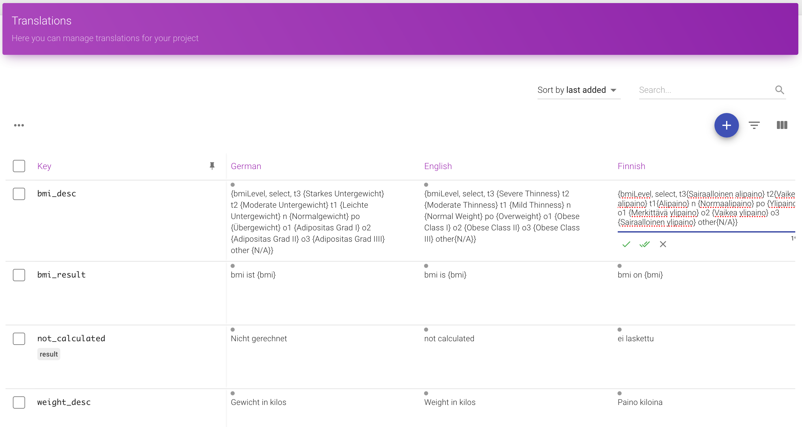

# bmi-calculator-app

Body Mass Index calculator implemented with Flutter

## What is BMI?

"BMI is a measurement of a person's leanness or corpulence based on their height and weight, and is intended to quantify tissue mass. It is widely used as a general indicator of whether a person has a healthy body weight for their height. Specifically, the value obtained from the calculation of BMI is used to categorize whether a person is underweight, normal weight, overweight, or obese depending on what range the value falls between." - https://www.calculator.net/bmi-calculator.html

## Technology

This project is a pretty simple technology demo

- Flutter for UI
- Localizely for Localization workflow
- CodeMagic for CI/CD
- Bloc pattern for separating logic from UI 
- bloc & bloc_flutter packages for implementation of Bloc  
- object equality implemented with equatable
- Bloc tested with with bloc_test
- Domain logic tested with normal unit test
- Additional test for user interaction

## Roadmap

Extend with BDD / ATDD tools, preferably Gherkin tests
- https://medium.com/@maheshmnj/testing-your-flutter-app-f08ebc54beb9
https://pub.dev/packages/flutter_gherkin

Try Screenshot tests, possibly with Golden Toolkit
- https://tech.ebayinc.com/engineering/ebay-motors-screenshot-testing-with-flutter/
- https://pub.dev/packages/golden_toolkit

Prepare distribution thru stores
- .. this might never happen, as there's quite limited value on adding this app to any kind of store 

## Calculate your BMI

Body mass index can be calculated from two values, and result correlates to persons healt. 

It's hard to think simpler app with real meaning in context of our lives.



Color of result corresponds to color on graph and there's even text explaining bmi result. How cool is that!

Note: Health is not a simple number game. Bmi has [limited value](https://www.ncbi.nlm.nih.gov/pmc/articles/PMC6477109/) on estimating overall health, so one should take care of not interpreting "normal weight" as "healthy" even if green color suggest that result is positive.  

## Implementing domain classes

Body mass index is calculated from height and weight of person. Result is single number. Two parameters, one number as result. Pretty neat.

World is still bit tricky
- In europe we have ISO system (KG, CM), but there's other systems in world also.
- There's well known way of calculating BMI, but also new way which should be more accurate.

While this app uses solely ISO (CM, KG) when calculating, it has classes for both traditional and new algorithm.

Traditional formula: 
- BMI = weight(kg)/height(m)^2 = 703 * weight(lb)/height(in)^2.

New formula: 
- BMI = 1.3 * weight(kg)/height(m)^2.5 = 5734 * weight(lb)/height(in)^2.5

Reason: It's ok to assume in contract of components that client does transformation between numeric systems. Still, we want algorithm to be isolated for use and testing.


There's test for each implemented algorithm. When testing later business logic components (bloc) and interaction (pages) we don't need to duplicate tests which are already done for domain objects.

Domain classes do not have dependencies to Flutter.

## Implementing Bloc pattern

Bloc pattern is implemented in BMI Calculator using 3rd party extension called [flutter_bloc](https://pub.dev/packages/flutter_bloc).

Calculator Bloc reacts on three events
- CalculatorReset 
- CalculatorHeightChanged containing persons height
- CalculatorWeightChanged containing persons weight

Bloc state is returned when bloc state changes
- State contains currently given height, weight and possibly calculated bmi 

Bloc itself is not Flutter specific, and can be used from other Dart apps and tests without Flutter.



Bloc is tested with specialized [bloc_test](https://pub.dev/packages/bloc_test) extensions, which makes it clean and simple to interact with sinks and streams.

Domain logic is separated from Bloc, and is tested with simple unit test. With separate tests we can concentrate on bloc tests to interaction with business logic, since we know that algorithm itself is already ok.

Note: due to design decision made reset event is never used. Nevertheless, it functions, and could be used if state would be managed in ui components differently.

Note: bloc_flutter is similarly named component as one we use, so be careful not to mix them.

## Immutabiliy, Object equality and Debugging bloc

Events & States are immutable. State needs to be compared to previous state in bloc to see if it has changed according to event.

Instead of generating model classes, using generated implementation of equals, hascode and toString or writing manually own boilerplate code there's single library which makes it really easy to implement these methods without polluting model classes with extra lines.

https://pub.dev/packages/equatable

Extending model with handy Equals & HashCode & toString features makes bloc also easy to debug - otherwise it might be really hard to unserstand what happens under the hood.

## Implementing UI components

BMI calculator is simple and has only one page. This page is shown after BmiCalcularApp is started.

Flutter uses composition to build views
- BmiCalcularApp is composed of MaterialApp, Scaffold and CalculatorPage during startup
- CalculatorPage is composed of BlocBuilder, Center, Column and HeightInput, WeightInput and BmiCalculationResult
- CalculatorPage is rendere when BlocBuilder receives state from bloc
- HeightInput, WeightInput and BmiCalculationResult are all rendered when associated BlocBuilder receives update
- HeightInput, WeightInput and BmiCalculationResult have all id's (key), which can used to identify fields ui component during test


Composition in CalculatorPage is done using separate stateless widgets and for this reason several bloc builders are used. For this app it would be possible to have all input and result widgets embedded within one BlocBuilder, but this would have been at some point simply too much.  

WidgetTester component is used to interact with ui fron test classes. All interactions with ui are async. When state of UI is changed it needs to be re-rendered. 


UI components are Flutter Widgets. So, from here on one can't reuse classes with for example Angular.

## Localization

Localization is pretty [complicated to implement](https://flutter.dev/docs/development/accessibility-and-localization/internationalization) completely without 3rd party tools. 

Localizations are normally defined using [ARB files](https://localizely.com/flutter-arb). There doesn't seem to have syntax highlighter for ARB content, which makes them harder to use as necessary.

Candidates for process / tooling / ..
- Flutter default process with [Intl package](https://pub.dev/packages/intl) 
- Additional translations collection with [Intl_traslations](https://pub.dev/packages/intl_translation)
- Experimental: Support for other formats than ARB with [int_translation_format](https://pub.dev/packages/intl_translation_format) and [intl_translation_xliff](https://pub.dev/packages/intl_translation_xliff)
- Code generation from ARB files with [intl_utils](https://pub.dev/packages/intl_utils)
- Saas service with [plugin to Android studio](https://plugins.jetbrains.com/plugin/13666-flutter-intl) and [VS Code](https://marketplace.visualstudio.com/items?itemName=localizely.flutter-intl) like [Localizely.com](https://localizely.com/)
- Saas service without integration to IDEs like [Phrase](https://phrase.com/) or [Crowdin](https://crowdin.com/) or [Loco](https://localise.biz/) or ..
- Windows, Linux & OSX desktop client like [BabelEdit](https://www.codeandweb.com/babeledit) from [CodeAndWeb](https://www.codeandweb.com)
- Clever library like [easy localization](https://pub.dev/packages/easy_localization)
- Clever Library plus [Some Python Scripts & Spreadsheet](https://itnext.io/flutter-localisation-google-sheets-api-python-internalisation-paradise-8439cab57866)


As the saying goes: "A fool with a tool is still a fool", so one must learn how flutter does localization.

### Experimenting with Localizely

[Localizely's localization workflow](https://localizely.com/flutter-localization-workflow/) can be integrated directly to IDE, which makes it easy to use, as developer doesn't ever need to leave IDE.

Android studios [Flutter_intl plugin](https://plugins.jetbrains.com/plugin/13666-flutter-intl) and Localizely project are connected with Localizelys developer specific api key and Localizelys project specific project id.



There might be different person in role of translator, or developer can do translations in addition to programming. In long run separating these roles is vital, but during this experiment I was working on both roles.

After some setup tasks and checking that needed dependencies are at place it is possible to use roundtrip of (1) create and edit ARB files - (2) upload ARB files to Localizely - (3) edit and add localizations using Localizelys web UI - (4) download ARB files from Localizely - (5) generate code for localization - (6) use localizations from flutter app.

Localizely has easy to understand UI



When placeholders are used they're just written as text and code generation takes care that they are easy to use from Dart code.

Localizing list of values like enums is possible using [ICU select syntax](https://localizely.com/flutter-arb).

Localizely support also plurals, but they aren't needed in Bmi Calculator.

When ARB files are downloaded from Localizely [Flutter_intl plugin](https://plugins.jetbrains.com/plugin/13666-flutter-intl) generates needed code to access localized keys. Code shouldn't be changed by developer as next roundtrip overwrites generated files.

I was using upload and download and they worked fine. 
- I created single ARB file by hand for EN locale.
- This seed ARB was uploaded to Localizely
- During localization Bmi Calculator I added ARB files for FI and DE using Android Studio and keys and localized texts using Localizely.
- After downloading updated ARB files I just needed to use automatically generated Dart artifacts to integrate localizations.
- Using localizations needed [localizationsDelegates](https://api.flutter.dev/flutter/material/MaterialApp/localizationsDelegates.html) to be defined from MaterialApp, WidgetTests to be altered due to [flutter bug at async loading of localizations](https://github.com/flutter/flutter/issues/22193) and using localizations in UI.

I managed to get Localizely translation workflow to run, but there was some issues which I did report to very helpful support.
- Android studio let me to give wrong localizely project id while [integrating to localizely](https://localizely.com/flutter-localization-workflow/), and later error message was stating Authorization problem when trying to upload ARBs to Localizely.
- Once integration to Localizely on IDE was simply grayed out - no idea why, and what brought it back - if it would have been longer time absent I would have needed to see how to accomplish needed tasks from command line using [intl_utils](https://pub.dev/packages/intl_utils) or using localizelys api's or user interface. 
- Generated code [intl_utils](https://pub.dev/packages/intl_utils) produces seems ok, and as generation is done by [intl_utils](https://pub.dev/packages/intl_utils) which Localizely has provided as open source package there should be always possibility to implement PR and fix issues.
- Tests didn't work after localization due to [bug in Flutter](https://github.com/flutter/flutter/issues/22193). This is not related to Localizely, but makes it very important to understand how Flutter works.
- I used translations with placeholders, which worked fine at the end, but Localizely didn't give warning when I was at first writing placeholders in wrong syntax - code generation did give error message, so I managed to fix it eventually.
- It is possible to localize list of strings using [ICU Select format](https://localizely.com/flutter-arb), which works just wonderful.  Editing complex rules in Localizely web UI wasn't really easy and I used external text editor and copy&paste additionally. I could have used IDE directly and write ICU to ARB, which might have been nicest way to programmer, but as Android studio does higlight ARB files just like normal JSON files it wouldn't have helped a lot to use IDE.
- Writing translations in Localizely was ok, but when having 3 languages focus on web app was changing and order of language columns was re-ordered when translations were entered, which surprised me quite a lot. It might be that one should always work with single language, not with several languages simultaneously as I did.
- When I did add [very good analysis](https://pub.dev/packages/very_good_analysis) to project I needed to switch off globally some [linting rules](https://github.com/VGVentures/very_good_analysis/blob/main/lib/analysis_options.1.0.0.yaml) 

See below my analysis_options.yaml, lines_longer_than_80_chars and always_declare_return_types needed to be globally turned out

```
include: package:very_good_analysis/analysis_options.yaml
linter:
  rules:
    public_member_api_docs: false
    lines_longer_than_80_chars: false
    always_declare_return_types: false
```

I could have opted [to not use code generation](https://localizely.com/blog/flutter-localization-step-by-step/), but it seemed good idea. Generated code is clean and simple to read, so one can understand what it does. Linting rules that I needed to switch off are not critical, even if I'd prefer not to turn off rules globally.

Experience was mostly positive, but there's still work to do on developer & Translator UX before it all works smoothly.

## CI/CD

Codemagic is used for CI/CD and integrating it was really simple. There was need to enable tests, since they were by default not active. 


Note: At first flutter app was at sub directory of repo. This might have worked with some configuration, since by default CodeMagic seems to think that in multirepo subdirectories are pure dart, not flutter apps. I decided to copy app to root of repository and after that all was very simple.

## Static analysis

Command *Flutter analyze* does static analyze to dart code.

When everything is ok locally then just select that Codemagic runs analyze during build. 

## Manually deploying to iOS from CI/CD artifacts - without Apple Developer Account

There seems to be several ways of deploying artifact produced with CI/CD to iOS device. I haven't so far tested them. I recommend to try stackoverflows recipe.

https://stackoverflow.com/questions/51254470/how-to-create-ipa-file-for-testing-using-runner-app/56666092

## Linux, Docker and iOs?

How cool is this: You can develop iOs apps with Linux. Haven't tested it yet, but it sounds just great.

https://blog.codemagic.io/how-to-develop-and-distribute-ios-apps-without-mac-with-flutter-codemagic/

## Further info

BLOC
- https://bloclibrary.dev/#/
- https://www.youtube.com/watch?v=knMvKPKBzGE&feature=youtu.be

Localization
- https://flutter.dev/docs/development/accessibility-and-localization/internationalization

ARB format
- https://localizely.com/flutter-arb/

ICU
- https://medium.com/i18n-and-l10n-resources-for-developers/the-missing-guide-to-the-icu-message-format-d7f8efc50bab
- https://unicode-org.github.io/icu/

Localizely
- https://localizely.com/flutter-localization-workflow/
- https://github.com/localizely/flutter-intl-plugin-sample-app

Phrase
- https://phrase.com/
- https://phrase.com/blog/posts/how-to-internationalize-a-flutter-app/

Crowdin
- https://crowdin.com/
- https://support.crowdin.com/supported-formats/

Arbify
- https://github.com/Arbify/Arbify
- https://pub.dev/packages/arbify

Loco
- https://localise.biz/

Easy Localization
- https://pub.dev/packages/easy_localization
- https://dev.to/remejuan/bringing-localization-into-your-widget-testing-71f

BabelEdit
- https://www.codeandweb.com/babeledit/tutorials/how-to-translate-your-flutter-apps

Libraries
- https://blog.codemagic.io/flutter-libraries-ebook-by-codemagic/

CI/CD
- https://codemagic.io
- https://blog.codemagic.io/flutter-step-by-step-tutorial/

Static analysis
- https://github.com/flutter/flutter/wiki/Using-the-Dart-analyzer
- https://docs.codemagic.io/testing/static-code-analysis/
